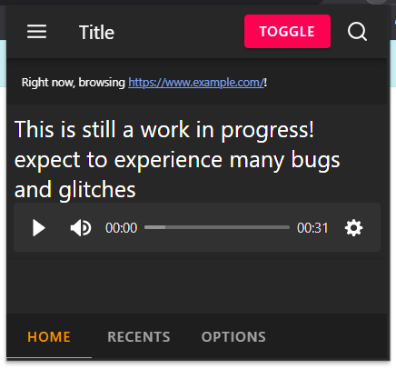
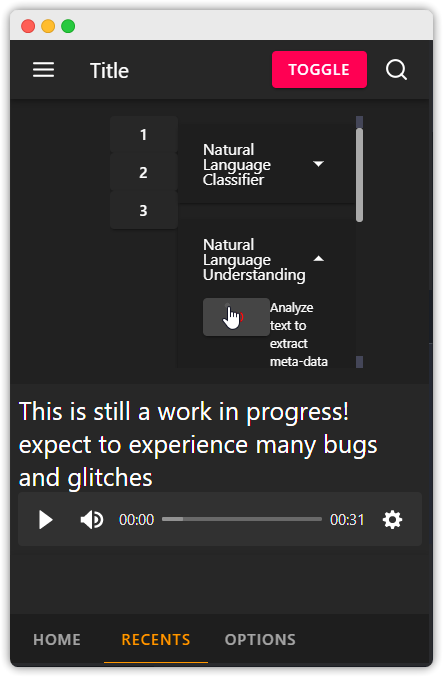
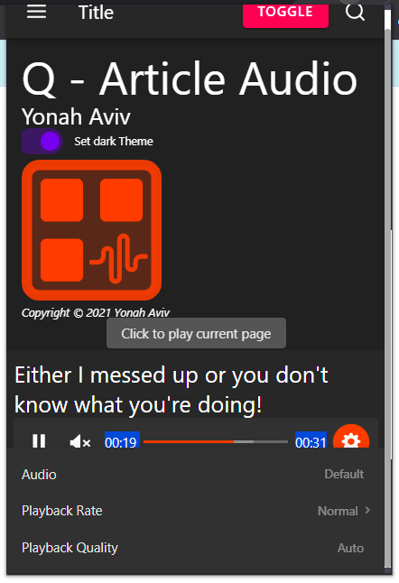

<h2>Q-Article Audio</h2>

 

<h6>Designed and Developed by Yonah Aviv</h6>

Note: _ALL VISUAL ASSETS(i.e. those very clean and nice-looking logos) ARE SUBJECT TO THE OWNERSHIP OF YONAH AVIV_, excluding feather icons imported from `svelte-feather-icons` node package

Scan a <b>QR code</b> in your browser to continue reading an article on your smartphone or tablet by <b>listening to the rest of an article</b> as a podcast which the QR code will navigate you to.

<h4>Demo: <a href="#" title="demo"><em>Coming soon</em></a></h4>

-------

Q-Article Audio, the Chrome extension, includes manfiest v3 and UI components from the material design library <a href="https://svelte-materialify.vercel.app/" title="Svelte Materialify">Svelte Materialify</a>. This chrome extension is coded with
- <a href="https://svelte.dev/" title="Svelte website">__Svelte__</a>
- <a href="https://rollupjs.org" title="webpack.js website">Rollup</a>

__Here are screenshots of a semi-functional version 0.0.1__(Using Material Design)

<ul>
<li>

</li>
<li>

</li>
<li>

</li>
<li>
</li>
</ul>
<h2>Features</h2>
<ul>

<li>
Uses chrome TTS api
<ul>
<li>Google's AI powered speech synthesis is lifelike and excellent</li>
</ul>
</li>
<li>
PWA also available
<ul>
<li>Cross-platform support</li>
</ul>
</li>
<li> Generates a QR code that will navigate towards the PWA which will contain your article as a podcast allowing you to listen on your smartphone quickly, on the go</li>
<li>
Lorem, ipsum dolor sit amet consectetur adipisicing elit.
</li>
<li>
Macro Mode - Have the text zoom in on the line and scroll while reading.
</li>
<li>
Archive -  Archive items that are taking up space in the recents pane but you still may want to reference for later.
</li>
<li>
Lorem, ipsum dolor sit amet consectetur adipisicing elit.
</li>
</ul>

-------
Note: <b>Unreleased on any web extension stores</b>
Feel free to try it out:

In your terminal(i use bash) :
 `git clone y330/q-article-audio`

then `cd q-article-audio`.

after this:
`pnpm i` Instead you can also use `NPM`,`yarn`, or another suitable package manager of your choice, but its my personal preference to use `pnpm`.

After installing dependancies with the previous command, type the following in your terminal:
`pnpm run dev`

then go to chrome://extensions and turn on developer mode, and press "load unpacked", and pick the dist directory in the q-article-audio folder. And your done!🤝

____

__Buy me a coffee:__

<a href="https://www.buymeacoffee.com/yonahaviv" title="Buy Yonah a coffee">
<a>

Copyright © 2021 <a class="author-link" href="https://y330.github.io" target="_blank" rel="noopener noreferrer" title="Yonah's website" > Yonah Aviv</a>

